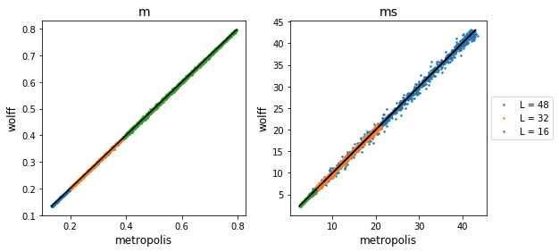
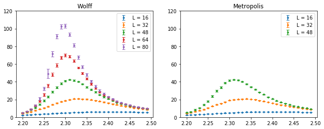
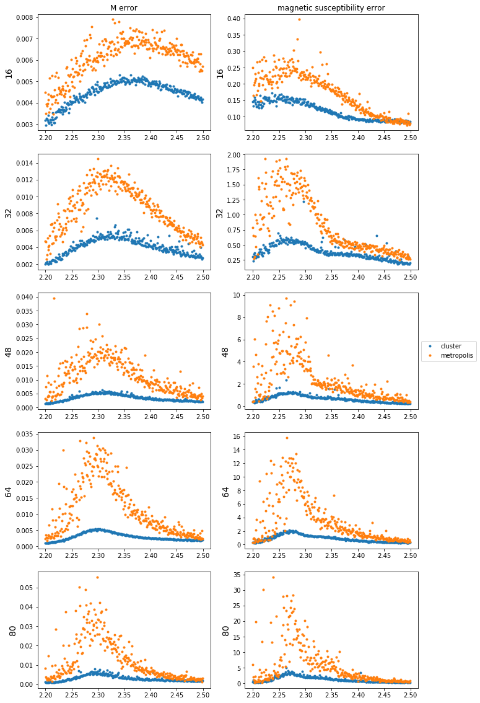
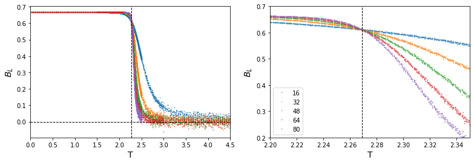
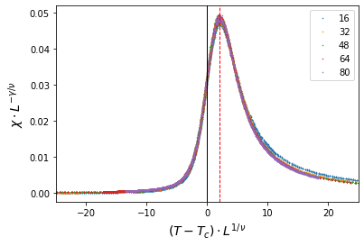

# I. Introduction

#### 1. Perform a Monte Carlo simulation on  [Ising model](https://en.wikipedia.org/wiki/Ising_model). 
> Here, I'll discuss about square lattice spin-1/2 simple classical Ising model.

​	For this Ising model, the energy configuration of state $\{s_i\}$ is given by Hamiltonian,  
$$
H = -J\sum_{<i,j>} s_is_j- B\sum_i s_i
$$
where $<i,j>$ means the nearest neighbor in lattice site, and $s_i = \pm 1$. 
	This model is a simplest model of a magnet. $J$ indicates the interaction between nearest neighbors, it is ferromagnetic for $J>0$, and anti-ferromagnetic for $J<0$. ($B$ stands for external magnetic field, which I will set as $0$.) Ising model has a critical point (second-transition point), and I'm going to invest the thermal properties near the point.


There exist some exact solution for 1 or 2-dimension lattice, however, I'm going to examine this model of finite size using Monte Carlo simulation by C++. 

#### 2.  Self learning Monte Carlo method
​	For classical Ising model, there exist a global update (e.g. cluster update) that reduces auto-correlation time successfully. However, for other models, we can only apply local update, which is extremely slow near critical point. By SLMC, we can expect faster global update for any model given by Hamiltonian. 

# II. Background

We'll discuss about some thermodynamic/statistical backgrounds as well as Monte Carlo methods. Also, we'll briefly talk about some solutions for Ising model.

## 1. Thermodynamics & Statistical physics
### 1.1. Partition function
 	[Partition function](https://en.wikipedia.org/wiki/Partition_function_%28statistical_mechanics%29) contains important information for a given system. 
$$
Z = \sum_{\{s\}}\exp(-\mathcal{H}(s)/kT), \; \mathcal{H} \text{ : Hamiltonian}
$$
 By using $Z$, we can drive some important physical quantities. 

- Probability of state: $P_s = \exp(-\mathcal{H}(s)/kT)/Z$

However, it is usually hard to get exact function when the system size increases, as we cannot sum all existing states. It is hard for one to drive thermodynamic quantities from ambiguous partition function.
### 1.2. Free energy
[	Helmholtz free energy](https://en.wikipedia.org/wiki/Helmholtz_free_energy) of a system is given by $$\mathcal{F} = -kT\ln Z$$ and other thermodynamic quantities can be obtained by simply calculation. As $\mathcal{F} = U - TS$, 
$$
\begin{aligned}

d\mathcal{F} &= dU - TdS -SdT 
\\ &= (TdS-PdV+\mu dN) -TdS-SdT
\\ &= -SdT - PdV+\mu dN

\end{aligned}
$$
Which implies 

$$S = -\left(\frac{\partial \mathcal{F}}{\partial T}\right)_{V, N}, P = -\left(\frac{\partial \mathcal{F}}{\partial V}\right)_{T, N}, \mu = -\left(\frac{\partial \mathcal{F}}{\partial N}\right)_{T, V}$$ 

Moreover, using these, we can obtain order parameters. Here, $\beta = kT$.
$$
U = -\frac{1}{Z}\frac{\partial Z}{\partial\beta} = -\frac{\partial}{\partial\beta}\ln Z = -T^2 \frac{\partial (\mathcal{F}/T)}{\partial T} = \langle E \rangle
\\ \begin{aligned} C &= T \frac{\partial S}{\partial T} = -\beta \frac{\partial S}{\partial \beta}= \frac{\partial U}{\partial T} = k\beta^2 \frac{\partial^2}{\partial \beta^2}\ln Z \\&=k\beta^2\left(\frac{1}{Z}\frac{\partial^2}{\partial\beta^2}Z - \left[ \frac{1}{Z}\frac{\partial}{\partial \beta}Z\right]^2\right) =k\beta^2(\langle E^2\rangle - \langle E\rangle^2) \end{aligned}
\\M = \frac{\partial \mathcal{F}}{\partial B} = \left\langle \sum_i s_i \right\rangle, \;\; \chi = \frac{\partial\langle M\rangle}{\partial B} = \beta (\langle M^2\rangle - \langle M \rangle ^2)
$$

where $U$ is internal energy, $C$ is [specific heat capacity](https://en.wikipedia.org/wiki/Specific_heat_capacity), $M$ is [magnetization](https://en.wikipedia.org/wiki/Magnetization), and $\chi$ is [magnetic susceptibility](https://en.wikipedia.org/wiki/Magnetic_susceptibility).

## 2. Some solution of classical Ising model[^2]

### 2.1. Exact solution for 1-dimension Lattice

​	Consider 1-dimensional Ising model of periodic boundary that has $N$ sites. Given Hamiltonian, the partition function is
$$
\begin{aligned}
Z =& \sum_{\{\vec{s}\}}\exp(\beta J (s_1s_2 + \cdots + s_N s_1)+ \beta B(s_1+\cdots+s_N))
\\=& \sum_{\{\vec{s}\}}\exp(\beta J (s_1s_2 + \cdots + s_N s_1)+ \frac{1}{2}\beta B((s_1+s_2)+\cdots+(s_N+s_1))
\\=& \sum_{\{\vec{s}\}}\underbrace{\exp(\beta Js_1s_2+\frac{1}{2}\beta B(s_1+s_2))}_{\langle s_1|T|s_2\rangle}\cdots\underbrace{\exp(\beta Js_Ns_1+\frac{1}{2}\beta B(s_N+s_1))}_{\langle s_N|T|s_1\rangle}
\\=& \sum_{s_1}\cdots\sum_{s_N}\langle s_1|T|s_2\rangle\cdots\langle s_N|T|s_1\rangle = \sum_{s_1}\langle s_1|T|s_1\rangle = \text{Tr}(T^N) = \sum\lambda_i^N
\end{aligned}
$$
The $T$ part acts like a matrix, as each spin is either $1$ or $-1$. 
$$
T = \begin{array}{c|cc}s_i, s_{i+1}&+1 & -1 \\\hline
+1 & e^{\beta(J+B)} & e^{-\beta J}
\\-1 & e^{-\beta J} & e^{\beta(J-B)}
\end{array}
$$
This matrix has eigenvalue of 
$$
\lambda = e^{\beta J}\cosh \beta B\,\pm\sqrt{e^{2\beta J}\cosh^2\beta B-2\sinh2\beta J} 
$$
For $B=0$, $\lambda = e^{\beta J}\pm e^{-\beta J}$. Using this, we can calculate free energy and internal energy each.
$$
\mathcal{F} = -kT\ln Z = -\beta N\ln 2\cosh\beta J
\\ U = -\frac{\partial}{\partial \beta}\ln Z = -JN\tanh\beta J
$$

### 2.2. Mean Field theory for d-dimension Lattice

From same Hamiltonian above, we'll discover partition function using mean field theory. 

First, let $s_i = \langle s\rangle+\delta s_i, \; s_j = \langle s\rangle +\delta s_j$, and put into Hamiltonian.
$$
\begin{aligned}
\mathcal{H} =& -J\sum_{\langle i,j\rangle}s_is_j - B\sum_i s_i = -J\sum(\langle s\rangle+\delta s_i)(\langle s\rangle+\delta s_j)-B\sum s_i 
\\=& -J\sum_{i,j} (\langle s\rangle^2+\langle s\rangle(\delta s_i+\delta s_j))-B\sum s_i=-J\sum (\langle s\rangle(s_i+s_j)-\langle s\rangle^2)-B\sum s_i
\\=& -2zJ\sum_i(\langle s\rangle s_i-\langle s\rangle^2)-B\sum s_i \;\;(z: \text{# of nearest neighbor})

\\Z =&\sum_{\{\vec{s}\}}\prod_i^N\exp\left(\frac{1}{2}\beta z J\langle s\rangle s_i+\beta B s_i\right)\exp(2\beta z J N\langle s\rangle^2)
\\=& \prod_i^N 2\cdot\frac{1}{2}\left(\exp(\frac{1}{2}\beta z J\langle s\rangle+\beta B)+\exp(-\frac{1}{2}\beta z J\langle s\rangle-\beta B)\right)\exp(2\beta z J N\langle s\rangle^2)
\\=& 2^N\cosh^N\left(\frac{1}{2}\beta z J\langle s\rangle +\beta B\right)\exp(2\beta z J N\langle s\rangle^2)^N
\\ P =& \exp(-\beta\mathcal{H}_i)
\\ \langle s\rangle =& \frac{\sum s_i P_i}{N\sum P_i} = -\frac{1}{N\beta}\frac{\partial \ln Z}{\partial B} = \tanh(1/2\,\beta zJ\langle s\rangle +\beta B)
\end{aligned}
$$
Large $\beta$ will cause 2 stable point of $\langle s\rangle\neq 0$ and 1 unstable point $\langle s\rangle=0$. For small $\beta$, $\langle s\rangle=0$ is the stable point. The point of transition will be the transition point, which is $T_c = z/2$ with dimension $J/k$.

### 2.3. Exact solution for 2-dimension Lattice

...

## 3. Markov Chain Monte Carlo (MCMC)

Above, I explained that exact partition function is difficult to figure out, however, by statistical Monte Carlo simulations, solving these functions are available. Generally, we use **Markov chain**, which requires careful design. 

### 3.1. Markov Chain (MC)[^6]

First order Markov chain only depends on the last previous state(conditional probability), and can be described by transition function.
$$
p(x^{(k+1)}|x^{(1)}, \cdots,x^{(k)}) \equiv p(x^{(k+1)}|x^{(k)})\equiv T_k(x^{(k)}, x^{(k+1)}), \;\text{where }k\in 1, \cdots,M
$$
This chain is homogeneous if  $\forall i, j, \,T_i = T_j$.

A distribution is invariant/stationary when a transition function of the chain leave the distribution unchanged, i.e.
$$
p^*(x) = \sum_{x'}T(x', x)p^*(x')
$$
Designing transition operator that makes distribution stationary is important in our case. The transition operator satisfies **detailed balance** by
$$
p^*(x)T(x, x') = p^*(x')T(x', x)
$$
If detailed balance is satisfied, the distribution is stationary under $T$.

Moreover, if the distribution $p(x^{(k)}|x^{(0)})\to p^*(x)$ (invariant) when $k\to\infty$, then the chain has property **ergodicity**. Poorly designed operator might divide set of states. That is, the distribution can reach any state after long time from any state. 

### 3.2. Application: update

In general, the transition operator from $a$ to $b$ is given by $T(a\to b) = A(a\to b)q(b|a)$.

#### 3.2.1. Local update: Metropolis-Hastings algorithm

We want to obtain $x^{(1)}\mapsto x^{(2)}\mapsto \cdots\mapsto x^{(m)}\cdots$. First, initialize, $\tau=1, \, x^{(\tau)}=?$

​	a. Propose $x^*\sim q(x^*|x^{(\tau)})$

​	b. Accept $x^*$ with acceptance ratio $A(x^{(\tau)}\to x^*) = \min\left(1, \frac{p(x^*)q(x^{(\tau)}|x^*)}{p(x^{(\tau)})q(x^*|x^{(\tau)})}\right)$

​	c. If accepted, $x^{(\tau+1)} = x^*$. Else, $x^{(\tau+1)} = x^{(\tau)}$.

​	d. Repeat above steps.

In our local update, proposal is given by $q(b|a) = \text{constant}$. I'll briefly explain the scheme of this algorithm.

1. Define lattice size ($L$) and nearest-neighboring index. Initialize each spin site randomly or like chess board; which has maximum energy level. (This will prevent super-cooling.)

   Nearest-neighboring index array will contain information of periodic boundary condition.

2. Define Monte-Carlo-one-step(**1 MC-step**) as following:

   * pick one spin site (randomly or checkerboard-style) and flip it. 
   * Calculate the energy difference ($=\Delta \mathcal{H}$).
   * If energy difference less than 0, accept the spin flip. Else, accept it by probability of $\exp(\Delta\mathcal{H}/kT)$. 
   * Perform above steps for whole spin site; which will be $L^2$.

3. Calculate important thermodynamic quantities:
   * Before calculation, perform 2000~2500 MC-steps to obtain accurate value.
   * Calculate magnetization and energy for 10000 times. For each data, throw a few steps according to the autocorrelation time. (e.g. Metropolis: $\theta \sim L^2$, Cluster: $\theta \sim L^{0.44}$)
   * Calculate magnetization, magnetic susceptibility, energy, specific heat...etc.

4. Do above steps for each temperature. Invest some quantities near critical point.

#### 3.2.2. Global update: Cluster update[^5]

​	Metropolis-local update takes tremendous time, and large autocorrelation between each state. We'll propose most successful global update method, which is cluster update. There are some fundamentals(**Fortuin-Kasteleyn cluster decomposition**) to discuss before explaining the algorithm.

First, let $\mathcal{H} = -\sum_{\langle i, j\rangle}s_is_j$ and $Z = \sum_{\{s\}}e^{-\beta \mathcal{H}}$. 

Remove interaction between fixed nearest-neighboring site of $\langle l, m\rangle$ : $\mathcal{H} _{l,m} = -\sum_{\langle i, j\rangle\neq \langle l, m\rangle} s_is_j$

Define new partition function, considering rather $s_i, s_j$ are same or different.

$$Z_{l, m}^{=}=\sum_{\{s\}}\delta_{s_l, s_m}e^{-\beta \mathcal{H}_{l, m}}, \; Z_{l, m}^{\neq}=\sum_{\{s\}}(1-\delta_{s_l, s_m})e^{-\beta \mathcal{H}_{l, m}}$$

The original partition function is $Z = e^\beta Z_{l, m}^=+e^{-\beta}Z_{l, m}^\neq$. 

Moreover, define $Z_{l, m}^{indep.} = \sum e^{-\beta \mathcal{H}_{l,m}} = Z_{l,m}^=+Z_{l,m}^\neq$, then partition function $Z = (e^\beta-e^{-\beta})Z_{l,m}^=+e^{-\beta}Z_{l,m}^{indep.}$

Since $Z^=$ contains only when $s_l=s_m$, and $Z^{indep.}$ contains no restriction for spin-links, the weighing factors can be considered as probabilities of bond between site $l, m$. 

$$p_{bond} = 1-e^{-2\beta}, \;Z = \sum p^b(1-p)^n 2^N$$

I'll introduce **Wolff-cluster update**, which has proposal $q(b|a)/q(a|b) \equiv p(b)/p(a)$. (And has acceptance ratio $=1$.)

1. Choose random site $i$, and select nearest-neighbor $j$.
2. If $s_i =s_j$, bond to cluster with probability $p = 1-e^{-2\beta J}$.
3. Repeat step 1 for site $j$, if it was in cluster. Keep until no more bond created.
4. Flip the entire cluster.

# III. Method

> c++: parameters, steps, throwing steps

​	To analyze this model, we need to get thermodynamic quantities in each temperature. There are some interesting results varying size of lattice. 

## 1. Ising model Analysis

### 1.1. Finite size scaling: critical exponent[^4]

​	For finite size system, phase transition are smooth, which needs some additional interpretation. For each pseudo-critical temperature at certain size, we can guess accurate critical temperature $T_c$ which can be only determined at infinite size.

We find singular point of free energy which is
$$
F(L, T) = L^{(a-2)/\nu}\mathcal{F}((T-T_c)L^{1/\nu})
$$
Calculation from free energy, we have nice scaling factors.
$$
M = L^{-\beta/\nu} \tilde{M}((T-T_c)L^{1/\nu})
\\ \chi = L^{\gamma/\nu}\tilde{\chi}((T-T_c)L^{1/\nu})
\\ C = L^{\alpha/\nu}\tilde{C}((T-T_c)L^{1/\nu})
$$
Ising model's [critical exponents](https://en.wikipedia.org/wiki/Ising_critical_exponents) are known as $\alpha = 0,\; \beta = 1/8,\; \gamma = 7/4,\; \nu = 1$. Moreover, $T_c=2/\ln(1+\sqrt{2})\simeq2.2692 $. 

Here, I'm scaling using $\chi$. 

​	Plotting $(T-T_c)L^{1/\nu}$ versus $\chi L^{-\gamma/\nu}$ to draw function $\tilde{\chi}$, and find the maximum point $y_{max}$. At this point, we can figure out real critical temperature by $y_{max} = (T_{L}-T_c)L^{1/\nu}$ ($T_{L}$: pseudo-critical point at size $L$.)  Plotting $L^{-1/\nu}$ versus $T_L$ will predict the real critical temperature.

#### + [Binder cumulant](https://en.wikipedia.org/wiki/Binder_parameter) $B_L$

​	By examining higher order, we can invest $T_c$ more precisely. 

$$B_L = 1 - \frac{\langle m^4\rangle}{3\langle m^2\rangle^2}$$

As system size goes to infinity, $B_L\to0$ for $T>T_c$  and $B_L\to2/3$ for $T<T_c$. 

### 1.2. Error analysis: Jack knife[^5]

​	As we calculated functions with depends on previous state(~autocorrelation), we have to implement new error-analyzing method for a given quantity $x$. 

1. Calculate average $\langle x\rangle$. 
2. Divide data into $k$ blocks (called binning); block size must be bigger than the autocorrelation time, to eliminate the impact of correlation.
3. For each block $i = 1, \cdots, k$, calculate $x^{(i)} = \frac{1}{k-1} \sum_{j\neq i} x_j$
4. Estimate error: $\delta_x^2 = \frac{k-1}{k}\sum_{i=1}^k (x^{(i)}-\langle x\rangle)^2$

### 1.3. Autocorrelation time [^7]

​	The autocorrelation function is the correlation of some parameter $X$ with delayed-itself as function of time. 
$$
\langle X(0) X(t)\rangle - \langle X\rangle ^2 = C(t) = \frac{1}{N-t}\sum_{n=1}^{N-t}(X_n - \langle X\rangle)(X_{n+t}-\langle X\rangle) \sim e^{-t/\tau_{exp}}
$$
For error analysis, we usually use **integrated autocorrelation time**.
$$
\tau_{int} = \frac{1}{2} + \sum_{t=1}^\infty C(t)\lesssim \tau_{exp} \;(\sim \text{for pure exponential function})
$$
By fast Fourier transformation (FFT), we can calculate integrated autocorrelation time of given parameter at $O(\log N)$ time.

## 2. Self Learning update method [^8]

​	The local update is the most general one, that can be performed on any model, however, very slow and inefficient. On the contrary, the global update is the most preferred one, but can only be applied on specific model. In this paper, the author developed some global update method using 'self learning' by linear regression. The brief outline follows:

1. Perform original local update using Metropolis-Hastings algorithm to make training data.

   * The data contains energy of spin configuration, nearest-neighbor correlation, next-nearest-neighbor correlation, and third-nearest-neighbor correlation. 

2. Learn effective Hamiltonian from this data: Using linear regression on energy and spin-correlations.

   * effective Hamiltonian $$\mathcal{H}_{eff} = E_0 - \sum_{k=1}^n \left( J_k\sum_{\langle i,j\rangle_k}s_is_j \right)$$: I'll consider case $n=1$ and $n=3$. 

   * Linear regression: Using python numpy library, $E_0$ and $\{J_i\}$ is calculated from given training data.

     ```python
     Jlist, err, _, _ = np.linalg.lstsq(target_mat, E_0, rcond=None)
     ```

3. Propose a move according to effective Hamiltonian, i.e. **create a cluster** using $\mathcal{H}_{eff}$.

   * Two different cluster-formation is elaborated below. (section 2.1 & 2.2)

4. Determine whether the proposed moves(=cluster) will be accepted(=flipped), using original Hamiltonian. The acceptance ratio is given by
   $$
   A_s(a\to b) = \min\left(1, \frac{p(b)q(a|b)}{p(a)q(b|a)}\right) = \min\left(1, \frac{p(b)p_{eff}(a)}{p(a)p_{eff}(b)}\right) = \min(1, \exp(-\beta[(E_b-E_b^{eff})-(E_a-E_a^{eff})]))
   $$

However, it is not over yet. We must obtain training data from critical point, where the local update perform poorly. 

​	a. Perform step 1 to get initial training data at temperature higher than critical point, s.t. $T_i=T_c+2$, and perform step 2.

​	b. By obtained effective Hamiltonian, create next training data by doing step 3 and 4 at $T<T_i$. Perform step 2 again.

​	c. Repeat 'step b' until the temperature reaches point $T_c$.

Lastly, by derived effective Hamiltonian, we will compare this with original Hamiltonian, for diverse temperature range.


​	To form a cluster considering only nearest-neighbor($J_1$) is simple, which is known as Wolff cluster method. However, to consider next-nearest-neighbors($J_2$) and third-nearest-neighbors($J_3$) is a complex problem. I've used two methods to solve this problem.

### 2.1. Consideration of nth-Nearest-Neighbor(nth-NN) on formation of cluster

​	First method I'll introduce is by including $J_2$ and $J_3$ correlation directly during construction of cluster. The brief scheme of this algorithm is to search the $J_2, J_3$ correlation inside the cluster. This method proceeds similar to Wolff cluster, however, in the interval, it considers 2nd-NN and 3rd-NN.  

1. Choose random site $i$. Select the nearest neighbor of $i$, call it $j$. 
2. Search for 2nd-NN and 3rd-NN for $j$ , inside the cluster. If the number of 2nd-NN and 3rd-NN inside cluster is each denoted by $n_2, n_3$, then the probability of bonding the site is  $p = 1 - \exp(-2\beta (J_1+n_2J_2+n_3J_3))$.
3. Repeat step 1 for site $j$, if it was in cluster. Keep until no more bond created.
4. This cluster will be flipped by considering acceptance ratio of $A_s$ above.

The key point of this cluster formation is the consideration of 2nd-NN and 3rd-NN inside bond-probability. 

### 2.2. Change acceptance ratio of cluster flipping

​	Second method is to change the acceptance ratio; form a cluster regarding to $J_1$ correlation, and accept/reject this cluster flip by considering $J_2, J_3$ correlation. This method was inspired by the shift of acceptance ratio during self-learning.

1. Construct Wolff-cluster using only information about 1st-NN, as formal. This step is identical with Wolff-cluster formation.

2. Accept this cluster flip regarding given Hamiltonian, that includes 2nd-NN and 3rd-NN.
   $$
   A^*(a\to b) = \min\left(1, \frac{p(b)q(a|b)}{p(a)q(b|a)}\right) = \min\left(1, \frac{p(b)p_{J_1}(a)}{p(a)p_{J_1}(b)}\right) = \min(1, \exp(-\beta[(E_b-E_b^{J_1})-(E_a-E_a^{J_1})]))
   $$
   Where $E^{J_1}$ implies the effective energy calculated using only 1st-NN.

   Actually, this step is similar to self-learning acceptance operator. 

3. This cluster flip will again be accepted or rejected regarding $A_s$ above.

For the overall acceptance ratio of cluster,
$$
A(a\to b) = \min\left(1, \frac{p(b)p_{eff}(a)}{p(a)p_{eff}(b)}\min\left(1, \frac{p_{eff}(b)p_{J_1}(a)}{p_{eff}(a)p_{J_1}(b)}\right)\right)
$$
where $p$ stands for original Hamiltonian that we are interested in, $p_{eff}$ for effective Hamiltonian, and $p_{J_1}$ for effective Hamiltonian of 1st-NN.


​	To test these two methods, I performed cluster-formation of this two and compared to Metropolis algorithm, using below Hamiltonian. (Metropolis is always right.)
$$
\mathcal{H} = -\sum_{k=1}^2\sum_{\langle i,j\rangle_k}J_k s_is_j, \,\text{where } J_1 = 1, \, -0.15<J_2<0.15
$$
 

​			*Comparison of metropolis update and cluster update using method 2.1 and 2.2*

| $J_2$       | -0.15      | -0.05      | 0.05       | 0.15       |
| ----------- | ---------- | ---------- | ---------- | ---------- |
| method: 2.1 | 0.84273832 | 0.99276231 | 0.99497835 | 0.95549145 |
| method: 2.2 | 0.99684442 | 0.99996033 | 0.99996566 | 0.99994447 |

The above table shows the R$^2$ value. In this next-nearest-model, it is clear that method of changing acceptance ratio works better.

# IV. Result & Discussion

## 1. Classical Ising model

To begin with, the classical Ising model of 
$$
H = -\sum_{<i,j>} s_is_j
$$
is used in this section. Furthermore, I'm going to compare the local and global update which was introduced before, and then examine some important quantities by various sizes. 

### 1.1. Comparison of Local & Global update: $m, \chi$

Local update was performed using Metropolis algorithm, and global update is Wolff cluster method. I'm going to calculate the accuracy of global update, and the efficiency compare to local update.

#### 1.1.1. R square

System size 16, 32, 48 was used to compare R square.


​										*Magnetization and Magnetic susceptibility comparison: (big) Metropolis (small) cluster*



​																			*(left) m(T) comparison (right) $\chi$(T) comparison*

#### 1.1.2. Integrated Autocorrelation time

System size of 8, 16, 32, 64, 128 was used here to compare autocorrelation. Parameter of magnetization and magnetic susceptibility was used to calculate integrated autocorrelation time. 

I'll start with magnetization autocorrelation time.

.png) .png)

​		*Autocorrelation function: (left) Metropolis update (right) Wolff cluster update*

.png) .png)

​		*Autocorrelation time: (left) Metropolis update (right) Wolff cluster update*

.png)Left graphs shows $\tau_{int}\sim L^z$. ($z = 0.44479$ for cluster, $z =  2.00119$ for metropolis.)

#### 1.1.3. Error comparison





​						*(left) Metropolis algorithm error (right) Cluster algorithm error*

The blue dots represents the error calculated by jack knife, and orange dots are standard deviations. 

### 1.2. Comparison of Lattice size

System size of 16, 32, 48, 64, 80 was used here for scaling.

#### 1.2.1. Thermodynamic quantities

Overall, magnetization was used here to calculate some quantities, such as magnetic susceptibility and Binder cumulant of magnetization.


​						*(left) Magnetization by different size (center) Magnetic susceptibility (right) Magnetic susceptibility in log scale*

#### 1.2.2. Binder cumulant using $m$



The vertical dashed line (--) represents the critical temperature, which is $T_c = 2/\ln(1+\sqrt(2))\simeq 2.2692$

#### 1.2.3. Finite size scaling using $\chi$

The value of maximum y position(red dashed line): $1.968705$

.png).png)

(left) The plot shows the linear fitting curve, including 3~5 points.

* include all points:  $2.053837x+2.268260$
* exclude $L=16$:  $2.059052x+2.268162$
* exclude $L=16, 32$:  $1.430204x+2.277027$

(right) By considering some standard deviation and errors, we could conclude that the critical temperature is about $T_c = 2.268 \pm 0.004$. 

## 2. Self Learning Monte Carlo method

> SLMC on plaquette-Ising model: E vs T, E vs E_eff
>
> Compare effective Hamiltonian of n=1 and n=3.

​	I'll mainly perform on plaquette-Ising model, which is
$$
\mathcal{H} = -J\sum_{\langle i, j\rangle}s_is_j-K\sum_{ijkl\in\Box}s_is_js_ks_l
$$
I'll focus on the case where $K/J = 0.2$. (Both positive and ferromagnetic)

 

By performing Metropolis-Hastings algorithm on plaquette-Ising model of system size 10, 20 and 40, we could conclude that $T_c = 2.493$, demonstrated by the following paper.

Moreover, by doing self-learning (actually, just energy fitting) of this plaquette Hamiltonian by effective Hamiltonian $\mathcal{H} = -\sum_{k=1}^{nth}\sum_{\langle i,j\rangle_k}J_k s_is_j$, I could decide whether considering 3rd-NN is better than 1st-NN during fitting.

Below, 1024 & 2048 means the number of data that was used for one fitting.


| R square | $2^{10}$           | $2^{11}$           |
| -------- | ------------------ | ------------------ |
| 1st-NN   | 0.9977622159345134 | 0.9979367589474513 |
| 3rd-NN   | 0.997696360155469  | 0.9979543930109472 |

It is true that considering 3rd-NN during fitting is usually more accurate, however, it does not seem to have big difference. 

### 2.1. Consideration of nth-NN on formation of cluster

.png)

.png)

| R square | $2^{10}$           | $2^{11}$           | $2^{12}$           |
| -------- | ------------------ | ------------------ | ------------------ |
| 1st-NN   | 0.9996268876183921 | 0.9997928031923388 | 0.9998775706675226 |
| 3rd-NN   | 0.966586965517033  | 0.9691316899978449 | 0.9712051149363949 |

| effective Hamiltonian | J1              | J2                | J3               |
| --------------------- | --------------- | ----------------- | ---------------- |
| 1st-NN                | 1.112$\pm$0.001 | .                 | .                |
| 3rd-NN                | 1.221$\pm$0.003 | -0.0682$\pm$0.004 | -0.017$\pm$0.004 |


### 2.2. Change acceptance ratio of cluster flipping

.png)

.png)

| R square | $2^{10}$           | $2^{11}$           | $2^{12}$           |
| -------- | ------------------ | ------------------ | ------------------ |
| 1st-NN   | 0.9996497667105083 | 0.9997915851810159 | 0.9998742868415753 |
| 3rd-NN   | 0.9980529594579894 | 0.9994300500264944 | 0.9996079715633984 |

| effective Hamiltonian | J1                | J2            | J3               |
| --------------------- | ----------------- | ------------- | ---------------- |
| 1st-NN                | 1.1126$\pm$0.0006 | .             | .                |
| 3rd-NN                | 1.26$\pm$0.02     | -0.1$\pm$0.01 | -0.009$\pm$0.004 |


# V. Conclusion

> shortcoming: no consideration of autocorrelation time of SLMC


# VI. Reference
1.  M. E. J. Newman and G. T. Barkema, _Monte Carlo methods in statistical physics_. Oxford: Clarendon Press, 2001.
2.  L. E. Reichl, _A modern course in statistical physics_. Weinheim: Wiley-VCH, 2017.
3.  C. J. Adkins, _An introduction to thermal physics_. Cambridge: Cambridge University Press, 2004.
4.  D. P. Landau and K. Binder, _A guide to Monte Carlo simulations in statistical physics_. Cambridge, United Kingdom: Cambridge University Press, 2015.
5.  K. Rummukainen, in _Monte Carlo simulation methods_, 2019.
6.  F. Wood, “Markov Chain Monte Carlo (MCMC),” in _C19 MACHINE LEARNING - UNSUPERVISED_, Jan-2015.
7.  D. Foreman-Mackey, “Autocorrelation time estimation,” _Dan Foreman-Mackey_, 17-Oct-2017. [Online]. Available: https://dfm.io/posts/autocorr/. [Accessed: 20-Aug-2020].
8.  J. Liu, Y. Qi, Z. Y. Meng, and L. Fu, “Self-learning Monte Carlo method,” _Physical Review B_, vol. 95, no. 4, 2017.  [(website)](https://arxiv.org/pdf/1610.03137.pdf )

